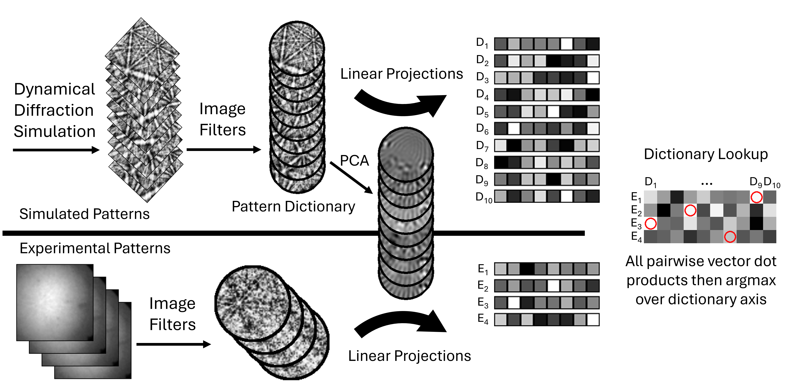

# Accelerating Dictionary Indexing of Electron Backscatter Diffraction Patterns with PCA and Quantization



**Authors:** Zachary T. Varley, Gregory S. Rohrer, Marc De Graef  
**Affiliation:** Carnegie Mellon University, Department of Materials Science and Engineering  

## Abstract

Dictionary indexing (DI) for Electron Backscatter Diffraction (EBSD) has conventionally traded computational speed for superior robustness to pattern noise when compared to traditional Hough indexing methods. To alleviate this computational bottleneck, we propose a novel Principal Component Analysis based Dictionary Indexing (PCA-DI) approach that uses dimensionality reduction and numerical precision optimization for accelerated pattern matching. A combination of synthetic benchmarks and benchmarks on a standard Nickel dataset with varying noise levels demonstrate significant speedup factors over conventional DI that scale with image resolution while maintaining or improving indexing accuracy, particularly under high-noise conditions where dimensionality reduction suppresses noise-dominated high-frequency components. Implementation with reduced numerical precision (FP16 and dynamic INT8 quantization) provides additional performance improvements without compromising indexing quality. The resulting approach enables substantially faster dictionary indexing on consumer-grade hardware, addressing scalability challenges for modern high-resolution EBSD systems and low-symmetry materials.


## Algorithm Overview

The PCA-DI method works by:

1. **Dictionary Generation**: Simulate EBSD patterns from a systematic sampling of orientation space
2. **PCA Training**: Learn principal components from the dictionary patterns using masked pixels
3. **Projection**: Transform both dictionary and experimental patterns to low-dimensional PCA space
4. **Matching**: Perform fast k-nearest neighbors search in the reduced dimensionality space
5. **Refinement** (Optional): Grid-based orientation refinement for sub-degree accuracy

This approach maintains indexing accuracy while dramatically reducing computational requirements.

## Dependencies

Install PyTorch version 2.0+ manually for your GPU / OS. Rest of the dependencies (for loading benchmarking datasets) via pip:

```
pip install kikuchipy seaborn
```

## Repository Structure

```
pcadi/
├── utils.py                     # utilities monofile (5800+ lines)
│   ├── Quaternion operations    # 3D rotation mathematics  
│   ├── Orientation representations # Cubochoric, homochoric, axis-angle, etc.
│   ├── EBSD geometry           # Pattern center, detector coordinates
│   ├── Master pattern handling # Interpolation and preprocessing
│   ├── PCA implementations     # Covariance matrix and streaming Oja
│   ├── Dictionary indexing     # Standard DI and PCA-DI algorithms
│   ├── KNN search engines      # Optimized with quantization support
│   └── Crystal symmetry        # Laue group operations
├── benchmark.py                # Comprehensive performance benchmarking
├── figure_main_summary.py      # Main figure generation for paper
├── figure_*.py                # Individual figure generation scripts
├── benchmark_*.py             # Specialized benchmark scripts
├── utils_knn.py              # K-nearest neighbors utilities
├── benchmark_results/         # Benchmark output data and figures
└── figure_main_summary/       # Main summary figure and assets
```

### Performance Benchmarking

Run comprehensive benchmarks to evaluate PCA-DI performance:

```bash
# Full benchmark suite (may take several minutes)
python benchmark.py

# Results saved to:
# benchmark_results/timing_breakdown.csv      # Detailed timing data
# benchmark_results/benchmark_dictionary.npy # Full benchmark results
```

### Generate Paper Figures

```bash
# Main summary figure (as shown above)
python figure_main_summary.py

# Individual component figures
python figure_patterns.py        # Pattern examples
python figure_eigenfaces.py      # PCA component visualization  
python figure_poisson.py         # Poisson noise analysis
python figure_stochastic_PCA.py  # Streaming PCA convergence
```

## Citation

If you use this code in your research, please cite:

```
Coming soon.
```

This repository is licensed under the MIT License - see the [LICENSE](LICENSE) file for details.